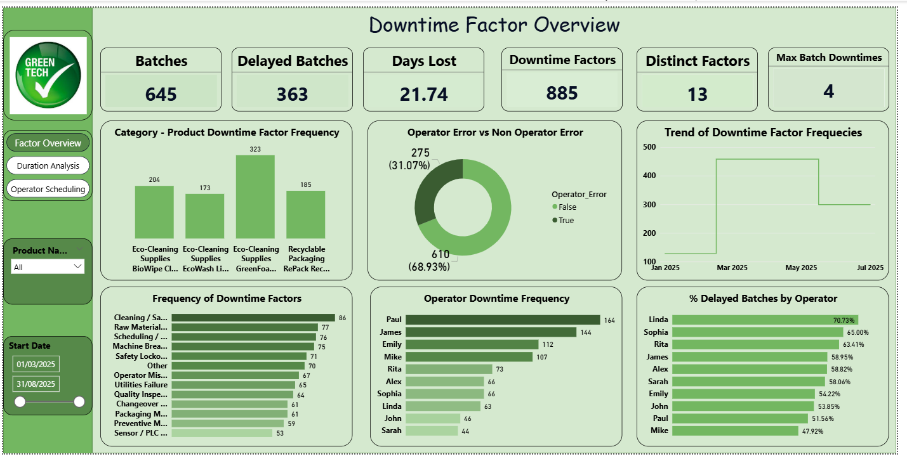
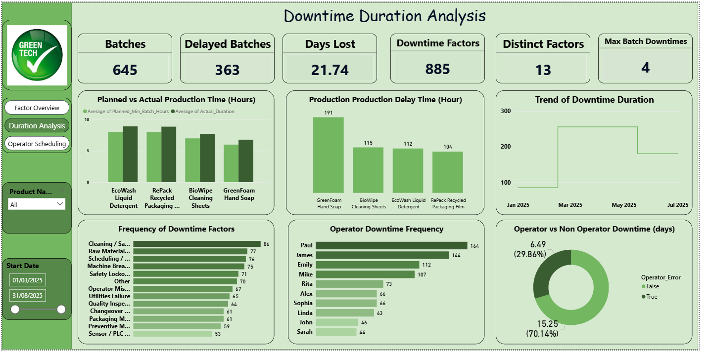
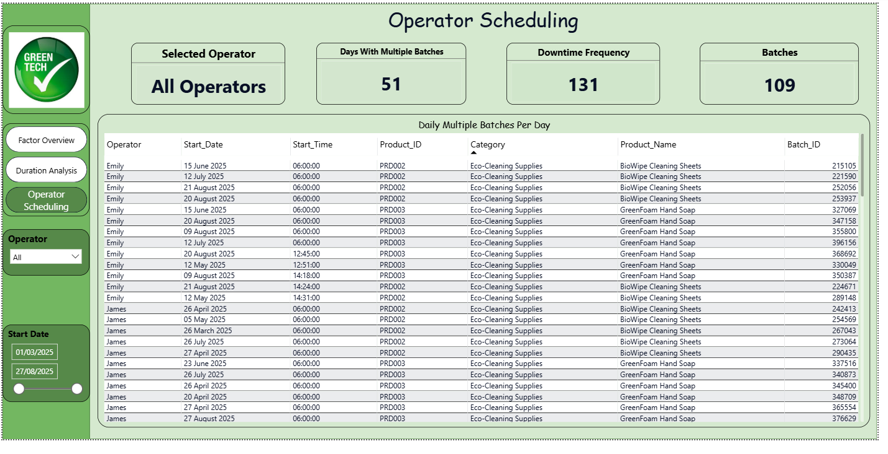

# 🏭 Evaluating Production Bottlenecks Through Downtime Analysis

## 🏢 Company Overview

**GreenTech Manufacturing** was founded in 2010 by a group of engineers and entrepreneurs with a vision to provide high-quality, sustainable consumer goods. Specializing in eco-friendly household products, GreenTech has grown from a small startup to a leader in the eco-friendly consumer goods space, reaching an annual revenue of **$100 million by 2023**.

All manufacturing takes place in **North Carolina**, ensuring tight control over production quality and supply chain management, while serving a global customer base.

### Core Products
| Product Line | Description |
|---|---|
| Eco-Cleaning Supplies | Biodegradable detergents, cleaning wipes, and soaps |
| Recyclable Packaging | Packaging materials made from post-consumer recycled content |
| Energy-Efficient Appliances | Small home appliances like air purifiers and fans |

### Key Differentiators
- **Sustainability** — Commitment to environmentally-friendly manufacturing practices
- **Local Manufacturing** — All production based in North Carolina for quality control
- **Customer Loyalty** — Strong brand built around sustainable living and product quality

---

## ❗ Business Challenge

GreenTech Manufacturing faces persistent challenges in its production schedules, impacted by unplanned downtime stemming from multiple factors:

- **Machine Failures** — Unexpected equipment breakdowns that halt production
- **Material Shortages** — Delays in raw materials leading to production stoppages
- **Inefficient Production Planning** — Poorly optimized schedules causing idle time and excessive changeovers
- **Manual Scheduling** — Heavy reliance on manual input leading to errors and misalignments
- **Limited Data Visibility** — Prevents proactive identification of bottlenecks

### Key Impact Areas
| Impact Area | Description |
|---|---|
| Operational Inefficiency | Wasted labor and unused machine time due to downtime |
| Financial Costs | Estimated **$1.5 million annual loss** from production delays |
| Customer Delays | Missed deadlines impacting customer satisfaction |
| Resource Wastage | Overstocking of some materials while others run out |

---

## 🎯 Project Objectives

The main objective is to optimize GreenTech's production schedules to minimize downtime, reduce operational costs, and increase overall efficiency through a data-driven approach.

**Specific Objectives:**
1. **Identify Root Causes of Downtime** — Analyze downtime records to determine key contributors (machine, material, operator error, etc.)
2. **Optimize Production Scheduling** — Use production and downtime data to create efficient schedules that minimize overlaps and idle time
3. **Improve Operator Allocation** — Ensure no operator runs overlapping shifts and optimize shift-to-product assignments
4. **Enhance Reporting Transparency** — Develop Power BI dashboards for real-time monitoring of production performance and downtime metrics
5. **Enable Continuous Improvement** — Establish a data feedback loop that supports continuous optimization and strategic planning

---

## 🛠️ Tools Used

- **Microsoft SQL Server** — Data extraction, transformation, and analysis using SQL queries
- **Power BI** — Interactive dashboards for real-time production and downtime monitoring

---

## 📊 Dashboard Preview





---

## 💡 Key Findings & Recommendations
- **Total Batches: 645 batches processed, with 363 delayed — meaning over 56% of all batches experienced downtime, a critical inefficiency**
- **Days Lost: 21.74 days lost to downtime across the period, with 885 downtime factors recorded spanning 13 distinct causes**
- **Maximum Downtime per Batch: A single batch experienced up to 4 downtime events, indicating severe bottlenecks on specific runs**
- **Top Downtime Causes: Cleaning/Sanitation (86) was the leading factor, followed by Raw Material Shortages (77), Scheduling Conflicts (76), Machine Breakdowns (75), and Safety Lockouts (71)**
- **Operator vs Non-Operator Errors: 68.93% (610) of downtime factors were non-operator related, while 31.07% (275) were caused by operator errors — meaning systemic and equipment issues are the bigger problem**
- **Downtime Duration: Non-operator errors accounted for 70.14% (15.25 days) of total days lost, while operator errors caused 29.86% (6.49 days)**
- **Most Affected Product: GreenFoam Hand Soap had the highest production delay time at 191 hours, far ahead of BioWipe Cleaning Sheets (115), EcoWash Liquid Detergent (112), and RePack Recycled Packaging Film (104)**
- **Planned vs Actual Production Time: EcoWash Liquid Detergent and RePack Recycled Packaging consistently exceeded planned production hours, indicating chronic underestimation in scheduling**
- **Highest Downtime Operators: Paul (164 incidents) and James (144) recorded the most downtime frequency, nearly double that of Sarah (44) and John (46)**
- **Highest Delay Rate by Operator: Linda had the highest percentage of delayed batches at 70.73%, followed by Sophia (65%) and Rita (63.41%), while Mike had the lowest at 47.92%**
- **Operator Scheduling Conflicts: 51 days had multiple batches running simultaneously, with a total downtime frequency of 131 and 109 batches affected — pointing to significant scheduling overlap issues**

### Recommendations
1. Prioritise Cleaning & Sanitation Protocols — As the top downtime cause, implement structured sanitation schedules between batches to reduce unplanned cleaning stoppages
2. Fix Raw Material Supply Chain — With 77 downtime events caused by material shortages, establish minimum stock thresholds and set up automated reorder triggers
3. Overhaul Production Scheduling — 76 scheduling conflicts and 51 days of overlapping batches indicate the manual scheduling system is failing; transition to automated scheduling software
4. Preventive Maintenance Programme — Machine breakdowns (75 incidents) can be reduced significantly with a structured preventive maintenance calendar for all equipment
5. Investigate GreenFoam Hand Soap Line — With 191 hours of delay, this product line needs a dedicated root cause analysis to identify why it consistently underperforms
6. Targeted Operator Training — Linda, Sophia, and Rita have the highest delay rates; provide focused retraining on batch management and error reduction
7. Rebalance Operator Workloads — Paul and James are handling disproportionately high batch volumes leading to more incidents; redistribute workloads more evenly across the team
8. Investigate the January–March Spike — The sharp drop in downtime after March 2025 suggests either an intervention worked or data collection changed; understanding this could help replicate improvements
9. Revise Production Time Estimates — EcoWash and RePack consistently exceed planned hours; update scheduling assumptions to reflect realistic production durations and reduce idle time

---

## 📁 Repository Structure

```
greentech-downtime-analysis/
│
├── README.md
├── Dashboard1.png                  ← Power BI dashboard screenshot
├── Dashboard1.png                  ← Power BI dashboard screenshot
├── Dashboard1.png                  ← Power BI dashboard screenshot
├── Greentech visuals.pbix          ← PowerBI file
└── SQLQuery1/                      ← SQL file
```

---

## 👤 Author

**Adewoye Oluwatimilehin Joseph**
[LinkedIn Profile](https://www.linkedin.com/in/adewoye-oluwatimilehin/)
